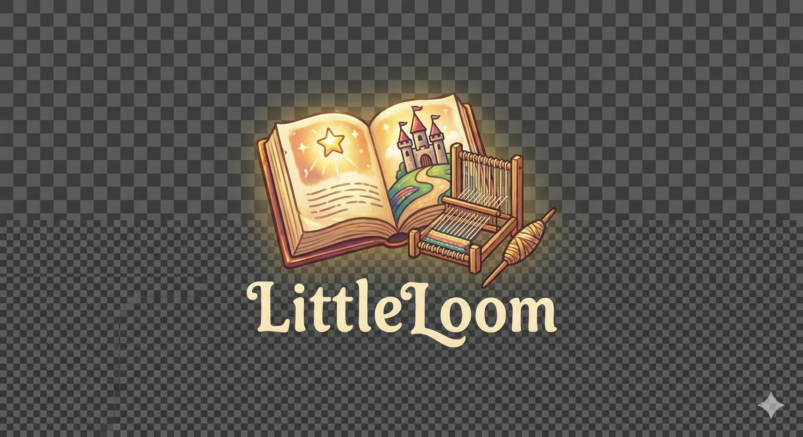

# 🌟 Little Loom - Children's Rights Learning Platform

<div align="center">



**An interactive, gamified platform that teaches children about their fundamental rights through engaging games, stories, and educational content.**

[](https://vercel.com/new)
[](https://opensource.org/licenses/MIT)

[Live Demo](#) • [Documentation](#) • [Report Bug](#) • [Request Feature](#)

</div>

---

## 📖 About

**Little Loom** is a child-friendly educational platform designed to teach children aged 6-14 about their fundamental rights under Indian law. Through interactive games, engaging stories, and gamified learning experiences, children learn about:

- 📚 **Right to Education** - Free and compulsory education for all children
- 🛡️ **Right to Protection** - Safety from abuse, exploitation, and child labour
- 🏥 **Right to Health** - Access to healthcare and nutritious food
- ⚖️ **Right to Equality** - No discrimination based on gender, religion, or caste
- 🆔 **Right to Identity** - Name and nationality from birth
- 🎮 **Right to Play** - Rest, play, and leisure activities

## ✨ Features

### 🎮 Interactive Games
- **Rights Runner** - Endless runner game collecting rights symbols
- **Rights Quiz** - Timed quiz challenges with explanations
- **Rights Detective** - Solve cases and identify rights violations
- **Rights City** - Build a city that protects children's rights
- **Rights Rescue** - Scenario-based decision-making game

### 📚 Educational Content
- **Learn Rights** - Comprehensive guides on each fundamental right
- **Legal Awareness** - Topics on child safety, online safety, school safety
- **Bilingual Support** - Available in English and Hindi (हिंदी)
- **Video Content** - Educational videos integrated into lessons

### 🏆 Gamification
- **XP System** - Earn experience points for learning
- **Levels & Badges** - Progress through levels and unlock achievements
- **Streak Tracker** - Daily learning streaks
- **Leaderboards** - Compete with other learners

### 👤 User Features
- **Profile Management** - Customizable avatars and profiles
- **Progress Tracking** - Monitor learning journey
- **Achievement System** - Unlock badges and rewards
- **Settings** - Update name, password, and preferences

## 🛠️ Tech Stack

### Frontend
- **React 18** - UI library
- **TypeScript** - Type safety
- **Vite** - Build tool and dev server
- **Tailwind CSS** - Styling
- **shadcn/ui** - UI components
- **Framer Motion** - Animations
- **React Router** - Navigation
- **i18next** - Internationalization

### Backend
- **Vercel Serverless Functions** - API endpoints
- **Supabase** - Database and authentication
- **Express.js** - Server logic (development)

### Tools & Libraries
- **React Query** - Data fetching
- **Sonner** - Toast notifications
- **React Confetti** - Celebration effects
- **Lucide React** - Icons

## 🚀 Quick Start

### Prerequisites

- **Node.js** 18+ and npm
- **Git**
- **Supabase Account** (for database)

### Installation

1. **Clone the repository**
   ```bash
   git clone https://github.com/shreyranjan18/little-loom.git
   cd little-loom
   ```

2. **Install dependencies**
   ```bash
   npm install
   ```

3. **Set up environment variables**
   
   Create a `.env` file in the root directory:
   ```env
   VITE_SUPABASE_URL=your_supabase_project_url
   VITE_SUPABASE_ANON_KEY=your_supabase_anon_key
   SUPABASE_SERVICE_ROLE_KEY=your_supabase_service_role_key
   ```

4. **Run database migrations**
   
   Set up your Supabase database using the migration files in `supabase/migrations/`

5. **Start development server**
   ```bash
   npm run dev
   ```

   The app will be available at `http://localhost:8080`

### Running Backend Server (Optional)

For local API development:

```bash
npm run dev:server
```

Or run both frontend and backend:

```bash
npm run dev:all
```

## 📁 Project Structure

```
little-loom/
├── api/                    # Vercel serverless functions
│   ├── achievements/       # Achievement endpoints
│   ├── games/             # Game-related endpoints
│   ├── leaderboard/       # Leaderboard endpoints
│   ├── profile/          # User profile endpoints
│   └── stats/            # Analytics endpoints
├── public/               # Static assets
│   ├── videos/           # Educational videos
│   └── favicon.ico       # Site favicon
├── server/               # Express backend (dev)
│   └── index.js         # API server
├── src/
│   ├── components/       # React components
│   │   ├── gamified/    # Gamified UI components
│   │   ├── layout/      # Layout components
│   │   └── ui/         # shadcn/ui components
│   ├── hooks/           # Custom React hooks
│   ├── i18n/           # Internationalization
│   ├── integrations/    # External integrations
│   │   └── supabase/   # Supabase client
│   ├── lib/            # Utility functions
│   ├── pages/          # Page components
│   │   └── games/      # Game components
│   └── App.tsx         # Main app component
├── supabase/            # Database migrations
│   └── migrations/     # SQL migration files
├── vercel.json         # Vercel configuration
└── package.json        # Dependencies
```

## 🌐 Deployment

### Deploy to Vercel

1. **Push to GitHub** (already done ✅)

2. **Import to Vercel**
   - Go to [vercel.com](https://vercel.com)
   - Click "Add New Project"
   - Import `shreyranjan18/little-loom`

3. **Configure Environment Variables**
   - Add `SUPABASE_URL`
   - Add `SUPABASE_SERVICE_ROLE_KEY`
   - Add `SUPABASE_ANON_KEY`

4. **Deploy**
   - Click "Deploy"
   - Your app will be live in minutes!

For detailed deployment instructions, see [VERCEL_DEPLOYMENT.md](./VERCEL_DEPLOYMENT.md)

## 🎯 Key Features Explained

### Rights Learning System
Each right has:
- Simple explanations in child-friendly language
- Legal context (Indian law references)
- Real-world problem scenarios
- Why it matters to children
- Mini missions to practice

### Game Mechanics
- **XP Rewards** - Points for completing activities
- **Difficulty Levels** - 1-4 dots indicating complexity
- **Progress Tracking** - Visual progress bars
- **Achievement Unlocks** - Badges for milestones

### Bilingual Support
- Full English and Hindi translations
- Language toggle in sidebar
- All content available in both languages

## 📚 Documentation

- [Quick Start Guide](./QUICK_START.md)
- [Game Development Guide](./GAME_DEVELOPMENT_GUIDE.md)
- [Backend Setup](./BACKEND_SETUP.md)
- [Vercel Deployment](./VERCEL_DEPLOYMENT.md)
- [Rights Runner Guide](./RIGHTS_RUNNER_GUIDE.md)

## 🤝 Contributing

Contributions are welcome! Please feel free to submit a Pull Request.

1. Fork the repository
2. Create your feature branch (`git checkout -b feature/AmazingFeature`)
3. Commit your changes (`git commit -m 'Add some AmazingFeature'`)
4. Push to the branch (`git push origin feature/AmazingFeature`)
5. Open a Pull Request

## 📝 License

This project is licensed under the MIT License - see the [LICENSE](LICENSE) file for details.

## 🙏 Acknowledgments

- **Supabase** - Database and authentication
- **Vercel** - Hosting and serverless functions
- **shadcn/ui** - Beautiful UI components
- **Framer Motion** - Smooth animations
- **React Community** - Amazing ecosystem

## 📞 Support

- **Issues**: [GitHub Issues](https://github.com/shreyranjan18/little-loom/issues)
- **Email**: [Your Email]
- **Documentation**: [Project Wiki](#)

## 🗺️ Roadmap

- [ ] Parent/Teacher dashboard
- [ ] Badge gallery page
- [ ] Rights Passport for kids
- [ ] Sound effects toggle
- [ ] Offline-friendly mode
- [ ] Mobile app (React Native)
- [ ] More games and content
- [ ] Community features

---

<div align="center">

**Made with ❤️ for children's education**

⭐ Star this repo if you find it helpful!

</div>
